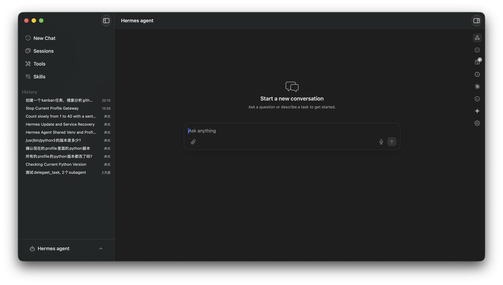

<p align="center">
  
</p>

<h1 align="center">Hermes Deck</h1>

<p align="center">🇨🇳 <a href="README.zh-CN.md">中文文档 / Chinese</a></p>

A native macOS client for the **Hermes** agent backend. Hermes Deck gives the local Hermes agent — and a set of external coding agents — a fast, chat-first SwiftUI interface, with session history, productivity panels, voice input, and per-profile configuration.

<!-- Built with SwiftUI + Swift Observation, talking to the Hermes backend over a JSON-RPC TUI gateway. -->

<p align="center">
  
</p>

## Features

- **Multi-agent chat** — Talk to the Hermes agent, or `@mention` another agent to route a message inline (with type-ahead autocomplete):
  - `Hermes` — the local agent backend, over a JSON-RPC TUI gateway (stdio)
  - `@codex` — [Codex](https://github.com/zed-industries/codex-acp) over the Agent Client Protocol (ACP)
  - `@claude` — Claude via the Claude CLI
  - `@gemini` — `agy` in single-shot print mode
  - `@<profile>` / `@default` — any Hermes profile, or the main Hermes agent
- **Agent-to-agent delegation** — An agent can hand part of a task to another agent by replying with an ` ```AgentRouting ` block (`@<target> <prompt>`). The Deck forwards it, feeds the reply back, and shows a live status card (waiting → replied, expandable) under the triggering message. Each session is auto-seeded with the convention and the current target list — no skill install needed — and malformed routing blocks get one self-correction attempt.
- **Profiles** — Switch between Hermes profiles (default / coding / research / custom); the picker is hidden when only one profile exists and locked while a reply is streaming. Switching profiles mid-thread starts a fresh session rather than mixing two gateways.
- **Sessions & history** — Browse past Hermes sessions (read from the backend SQLite database) and reopen them in chat; clickable rows in the sidebar History.
- **Productivity panels** (right sidebar) — Kanban board, scheduled Jobs (cron), per-agent panels for Codex / Claude / Gemini, plus a Settings panel.
- **Tools & Skills** — View and toggle installed Hermes tools and skills.
- **Voice input** — Dictation via `SFSpeechRecognizer`, with a selectable recognition language (Settings → Dictation Language).
- **Settings** — App theme (System / Light / Dark, follows the OS by default), dictation language, and the installed Hermes backend version.
- **Reading-friendly streaming** — Scrolling up during a streaming reply pauses auto-follow; it resumes (jumping back to the bottom) 2s after you stop, or immediately once you scroll back down. Completed messages don't re-render per token, so long streams stay smooth even with a side panel open.
- **Lifecycle** — Closing the window keeps the app (and warm per-profile gateways) in the Dock; ⌘Q quits and tears the spawned subprocesses down (gateways + ACP adapter trees).
- **Graceful degradation** — Clear placeholder when the Hermes backend isn't installed; friendly errors when a command (hermes / sqlite3 / node / an ACP adapter) is missing, instead of raw POSIX failures; bounded ACP handshake so a stuck adapter can't hang the UI.

## Requirements

- **macOS 14.0 (Sonoma) or later** — the deployment target. (Built with the macOS 27 SDK / a recent Xcode.)
- **Hermes agent backend** installed at `~/.hermes/hermes-agent` (provides the `hermes` CLI, a Python virtualenv, and the SQLite databases).
- `sqlite3` available at `/usr/bin/sqlite3`.
- For external agents: Node/`npx` (Codex ACP), the Claude CLI (`@claude`), and `agy` (`@gemini`) on `PATH` as needed.

## Build & Run

**Xcode**

1. Open `hermes_deck.xcodeproj`.
2. Select the `hermes_deck` scheme.
3. Run (⌘R). The **Yams** Swift Package dependency resolves automatically.

**Command line**

```bash
xcodebuild build \
  -project hermes_deck.xcodeproj \
  -scheme hermes_deck \
  -destination 'platform=macOS'
```

## Testing

157 unit tests (Swift Testing). The suite mixes behavioral tests with source-introspection checks. (The placeholder UI test target is skipped.)

```bash
xcodebuild test \
  -project hermes_deck.xcodeproj \
  -scheme hermes_deck \
  -destination 'platform=macOS' \
  -only-testing:hermes_deckTests
```

## Architecture

- **UI** — SwiftUI with Swift `Observation`. `ChatStore` (`@MainActor @Observable`) is the single source of truth.
- **Service layer** — Protocol-per-capability (`HermesSessionProvider`, `HermesProfileProvider`, `HermesGatewayProvider`, tools/skills/jobs/kanban/models …) with `Local*Provider` implementations backed by actors and `Process`.
- **Agent clients** — `HermesTUIGatewayClient` (JSON-RPC over the gateway's stdio), `ACPAgentClient` + `ACPConnection` (Agent Client Protocol for Codex), `ClaudeCLIClient`, `AgyClient`, all multiplexed by `RoutingAgentClient`.
- **Routing** — `@mention` parsing and the `AgentRouting` block grammar live in `AgentMentionRouteParser`; `ChatStore+Routing` drives the fan-out, status cards, and self-correction; sessions are primed via `AgentRoutingPrimer`. See [docs/AgentRoutingPrimer.zh-CN.md](docs/AgentRoutingPrimer.zh-CN.md) for the full design.
- **Config** — YAML parsed with [Yams](https://github.com/jpsim/Yams); Hermes config under `~/.hermes`.

## License

Released under the [MIT License](LICENSE) © 2026 Hermes Deck.
